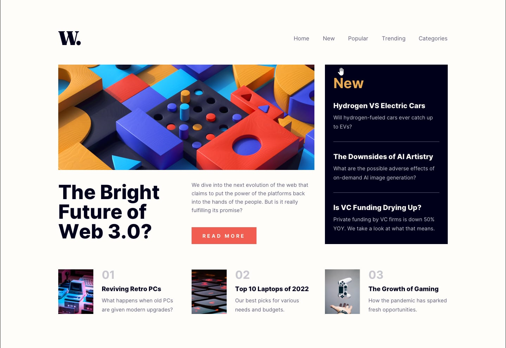

# Frontend Mentor - News homepage solution

This is a solution to the [News homepage challenge on Frontend Mentor](https://www.frontendmentor.io/challenges/news-homepage-H6SWTa1MFl). Frontend Mentor challenges help you improve your coding skills by building realistic projects. 

## Table of contents

- [Overview](#overview)
  - [The challenge](#the-challenge)
  - [Screenshot](#screenshot)
  - [Links](#links)
- [My process](#my-process)
  - [Built with](#built-with)
  - [What I learned](#what-i-learned)


## Overview
Very basic news landing page made with HTML & SCSS.
This is my first practice project using SCSS after learning some theorical concepts.
### The challenge
Found challenging finding a way to make a scss function to work with 
col-1-(to)-12 (implementing the class into the html instead of declaring a new col with width throughout the Scss files.)

Users should be able to:

- View the optimal layout for desktop (mobile responsiveness not ready yet.)

### Screenshot



### Links

- Solution URL: [Add solution URL here](https://your-solution-url.com)
- Live Site URL: [Add live site URL here](https://your-live-site-url.com)

## My process

### Built with

- Semantic HTML5 markup
- CSS
- SCSS/SASS
- Flexbox

### What I learned

its always nice to recap some basic stuff like flexbox properties, how to center a DIV 😅 and so on !
I've been reading about Sass and BEM methodology so i used this practice project to put it to practice for the first time.
```scss
//function to call col-1 col-2 up to 12, into html file class.
@for $i from 1 through 12 {
    .col-#{$i} {
        width: calc($i * 100% / 12);
    }
}
